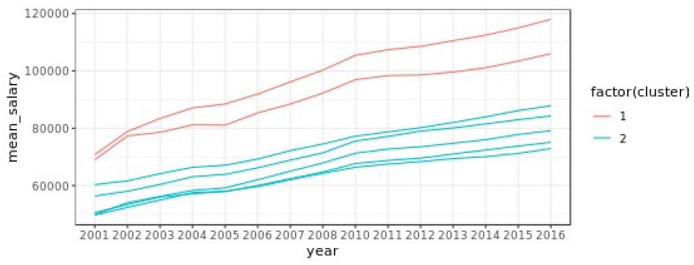
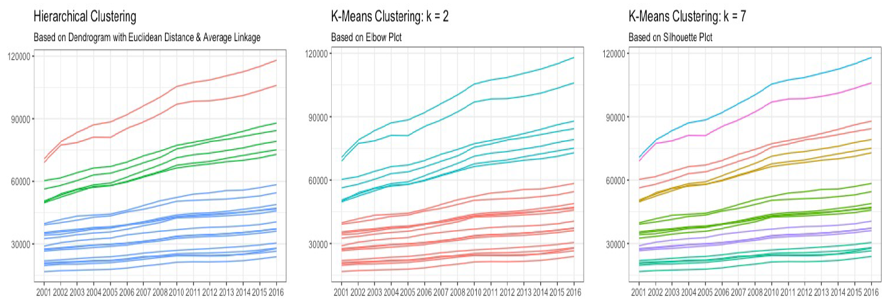

```{r setup, include=FALSE}
knitr::opts_chunk$set(echo = TRUE)
```

```{r}
# Librerías necesarias

library(readr)
library(cluster)
library(factoextra)
library(tidyverse)

```

## Problema 1

Descargue el archivo **ingreso**, en el cual se encuentra la información de el ingreso promedio para diferentes profesiones en los Estados Unidos desde el año 2001 hasta 2016.

```{r}
ingreso <- read_csv("../Data/ingreso.csv")

ingreso.matrix <- as.matrix(ingreso[,2:16])
rownames(ingreso.matrix) <-  as.matrix(ingreso[,1])

# Matriz de datos
ingreso.matrix
```

Se desea realizar un análisis de Cluster con este conjunto de datos. (necesitara modificar el data frame para quitar las variables que no sean numéricas)

- Calcule la matriz de distancia euclidiana.

```{r}
ingreso.distancia <- dist(ingreso.matrix, method = "euclidean")

# Matriz de distancia euclidiana
ingreso.distancia

# Gráfica de matriz de distancia
fviz_dist(dist.obj = ingreso.distancia)
```

- Genere una análisis de cluster con el método average.

```{r}
ingreso.cluster <-hclust(ingreso.distancia, method = "average")
ingreso.cluster
```

- Dibuje un dendograma de este análisis.

```{r}
plot(ingreso.cluster, hang = -0.01, cex = 0.6)
```

## Problema 2

Se necesita explorar los resultados anteriores (corte el dendograma con h=100,000), para ello necesitara crear un data frame con las siguientes columnas, **Ocupación, cluster, año, salario_promedio,** ejemplo:

| Ocupación        | Cluster | Año   | Salario_promedio |
| :--------------- | :-----: | :---: | :--------------: |
| Computer Science | 2       | 2002  | 61630            |

Sugerencia( Agregue la columna cluster a su data frame original, después utilice la función gather de la librería tidyverse, para formar el data frame)

- Obtenga el dendograma diferenciando cada cluster con un color diferente.

```{r}
fviz_dend(ingreso.cluster, k=3, cex= 0.5, color_labels_by_k = TRUE, rect = TRUE, rect_fill = T) +
  geom_hline(yintercept = 100000, linetype = "dashed") +
  labs(title = "Herarchical clustering",
       subtitle = "Distancia euclídea, Método de average")
```

- Dibuje un grafico de los individuos utilizando el método de componentes principales, diferenciando cada cluster con un color(utilice los comandos de factoextra).

```{r}
ajuste <- cutree(ingreso.cluster, k=3)
table(ajuste)

print(rownames(ingreso.matrix)[ajuste==1])
print(rownames(ingreso.matrix)[ajuste==2])
print(rownames(ingreso.matrix)[ajuste==3])

fviz_cluster(list(data = ingreso.matrix, cluster = ajuste), ellipse.type = "convex", 
             show.clust.cent = FALSE, ggtheme = theme_minimal())
```

Con los resultados anteriores se procede a crear el data fame solicitado.

```{r}
# Secre la función para crear el data frame y que será utilizada en e problema 4 
df_analisis <- function(k, m, ajuste, df) {
  vector.ocupacion <- c()
  vector.cluster <- c()
  fila <- 1
  for (i in 1:k) {
    for (elemento in rownames(m)[ajuste==i]) {
      vector.ocupacion[fila] <- elemento
      vector.cluster[fila] <- i
      fila <- fila + 1
    }
  }
  
  df_clusters <- data.frame(vector.ocupacion, vector.cluster)
  names(df_clusters) <- c("X1", "Cluster")
  
  ingreso.clusters <- gather(left_join(df, df_clusters, by = "X1"), "Año", "Salario_promedio", 2:16)
  names(ingreso.clusters) <- c("Ocupacion", "Cluster", "Anio", "Salario_promedio")
  
  ingreso.clusters
}

ingreso.clusters <- df_analisis(3, ingreso.matrix, ajuste, ingreso)
ingreso.clusters
```

## Problema 3

Se desea conocer las tendencias de los salarios, utilizando el data frame obtenido en el inciso anterior, realice un grafico (curva) para explorar la relación de la variable año, con la variable salario, esto para cada cluster, utilice:
**ggplot()+geom_line(aes(group(Ocupacion))).**

Deberá obtener algo parecido al siguiente grafico



```{r}
ggplot(ingreso.clusters, aes(x=Anio, y=Salario_promedio, group=Ocupacion)) +
  geom_line(aes(color=as.factor(Cluster)))+
  geom_point(aes(color=as.factor(Cluster))) +
  labs(title="Cluster Jerarquico")
```

## Problema 4

Se desea analizar el mismo problema utilizando el algoritmo Kmeans.

- Utilice el criterio del codo para determinar un numero adecuado de k (grafique la suma de cuadrados).

```{r}
set.seed(2)

ingreso.km <- kmeans(ingreso.matrix, centers = 1)$betweenss

for (i in 2:10) {
  ingreso.km[i] <- kmeans(ingreso.matrix, centers = i)$betweenss
}

fviz_nbclust(ingreso.matrix, kmeans, method = "wss") + geom_vline(xintercept = 4, linetype = 2)

plot(1:10, ingreso.km, type = "b", xlab = "Número de clusters", ylab = "Suma de cuadrados")

```

**De acuerdo a las gráficas anteriores, se concidera a k = 4 como un número óptimo.**

- Grafique con PCA y el método de kmeas, utilizando centers=2 y 7.

```{r}
ingreso.km2 <- kmeans(ingreso.matrix, nstart = 25, centers = 2)

fviz_cluster(ingreso.km2, data = ingreso.matrix, star.plot = TRUE, ellipse.type = "eclid", repel=T, ggtheme = theme_minimal())

ingreso.km7 <- kmeans(ingreso.matrix, nstart = 25, centers = 7)

fviz_cluster(ingreso.km7, data = ingreso.matrix, star.plot = TRUE, ellipse.type = "eclid", repel=T, ggtheme = theme_minimal())
```

- Realice el grafico de tendencia del problema 3 solo que con kmeans con centers=2 y centers=7.
```{r}
ingreso.clusters <- df_analisis(2, ingreso.matrix, ingreso.km2$cluster, ingreso)

ggplot(ingreso.clusters, aes(x=Anio, y=Salario_promedio, group=Ocupacion)) +
  geom_line(aes(color=as.factor(Cluster)))+
  geom_point(aes(color=as.factor(Cluster))) +
  labs(title="Cluster K-means con k=2")

ingreso.clusters <- df_analisis(7, ingreso.matrix, ingreso.km7$cluster, ingreso)

ggplot(ingreso.clusters, aes(x=Anio, y=Salario_promedio, group=Ocupacion)) +
  geom_line(aes(color=as.factor(Cluster)))+
  geom_point(aes(color=as.factor(Cluster))) +
  labs(title="Cluster K-means con k=7")
```

## Problema 5

En los problemas anteriores dibujo varios gráficos de tendencia, deberían ser los siguientes.
De acuerdo a estas figuras.

¿Qué puede decir sobre la "mejor" forma de agrupar estos datos? (¿cual afirmación es correcta?)



a. Todos los grupos generados por el grupo jerárquico tienen miembros con una distancia euclidiana entre ellos menor de 100,000 y, por lo tanto, es el mejor método de grupo.

b. Los grupos generados usando k-medias con k = 2 se identificaron mediante análisis de codo y, por lo tanto, es la mejor manera de agrupar estos datos.

c. Los grupos generados usando k-means con un k = 7 muestran una buena segmentación de los grupos en el grafico de tendencias.

d. Todo lo anterior es correcto, pero la mejor manera de agrupar depende en gran medida de cómo usaría estos datos después.

**La afirmación correcta sobre la mejor forma de agrupar los datos es la indicada en el inciso d**

*_d. Todo lo anterior es correcto, pero la mejor manera de agrupar depende en gran medida de cómo usaría estos datos después._*

## Problema 6

si utiliza kmeans con k=7 obtenga:

- El promedio y desviación estándar del salario promedio para cada cluster en cada año

```{r}
ingreso.km7

# Promedio del salario promedio para cada cluster en cada año
aggregate(ingreso.matrix, by=list(cluster=ingreso.km7$cluster), mean)

#Desciasión estándar del salario promedio para cada cluster en cada año
aggregate(ingreso.matrix, by=list(cluster=ingreso.km7$cluster), sd)
```


- Repita el inciso anterior con cluster jerárquico con k=3 y método average

```{r}
# ingreso.cluster se calculo en el problema 1
clusters <- cutree(ingreso.cluster, k=3)

# Promedio del salario promedio para cada cluster en cada año
aggregate(ingreso.matrix, by=list(cluster=clusters), mean)

#Desciasión estándar del salario promedio para cada cluster en cada año
aggregate(ingreso.matrix, by=list(cluster=clusters), sd)
```