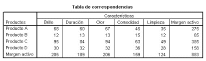

```{r setup, include=FALSE}
knitr::opts_chunk$set(echo = TRUE)
```

```{r}
# Librerías necesarias

library(readr)
library(ggplot2)
library(FactoMineR)
library(factoextra)
library(corrplot)
library("gplots")
```

## Problema 1

Para el conjunto de datos de consumo de proteína,

```{r}
protein <- read.csv("../Data/protein.csv")
protein.data <- protein[2:10]
rownames(protein.data) <- protein[,1]
head(protein.data, 2)
```

- Grafique el escalado multidimensional en 2 variables sin escalar con la distancia euclidiana.

```{r}
protein.dist <- dist(protein.data, method = "euclidian")
protein.cmd <- cmdscale(protein.dist)
protein.cmd <- as.data.frame(protein.cmd)
ggplot(protein.cmd, aes(x = V1, y = V2, label = rownames(protein.data))) + 
  geom_text(alpha = 0.8, size=3, col = "salmon")
```

- Grafique el escalado multidimensional en 2 variables escalando con la distancia euclidiana.

```{r}
protein.dist <- dist(scale(protein.data), method = "euclidian")
protein.cmd <- cmdscale(protein.dist)
protein.cmd <- as.data.frame(protein.cmd)
ggplot(protein.cmd, aes(x = V1, y = V2, label = rownames(protein.data))) + 
  geom_text(alpha = 0.8, size=3, col = "salmon")
```

- Para el inciso anterior, utilice la matriz $$
\begin{bmatrix}
cos\theta & -sen\theta \\
sen\theta & cos\theta \\
\end{bmatrix},
$$   para rotar los puntos 45 grados, grafique  el resultado.

```{r}
protein.dist <- dist(scale(protein.data), method = "euclidian")
protein.cmd <- cmdscale(protein.dist)
protein.cmd <- protein.cmd%*%matrix(c(0.707,-0.707,0.707,0.707),2,2)
protein.cmd <- as.data.frame(protein.cmd)
ggplot(protein.cmd,aes(x = V1, y = V2, label = rownames(protein.data))) + 
  geom_text(alpha = 0.7, size = 3, col = "red")
```

## Problema 2

Para la siguiente tabla de contingencia realice un análisis de correspondencia



```{r}
productos <- matrix(c(66,  60,  67,  45,  35,  275,
                      12,  13,  13,  15,  12,  65,
                      95,  84,  94,  63,  49,  365,
                      30,  32,  32,  36,  28,  158,
                      205, 189, 206, 159, 124, 883), nrow = 5, byrow = T)
rownames(productos) <- c("Producto A", "Producto B", "Producto C", "Producto D", "Margen activo")
colnames(productos) <- c("Brillo", "Duración", "Olor", "Comodidad", "Limpieza", "Margen activo")
productos
```

- Represente  en dos dimensiones las filas y las columnas.

```{r}

# Representacion de las filas

ca_ht <- CA(productos[1:4,1:5], graph = F)
filas <- get_ca_row(ca_ht)
head(filas$coord)
head(filas$cos2)

fviz_ca_row(ca_ht, col.row = "cos2",
            gradient.cols = c("orange", "yellow","salmon"), 
            repel = TRUE)

# Representacion de las columnas

ca_ht <- CA(productos[1:4,1:5], graph = F)
columnas <- get_ca_col(ca_ht)
head(columnas$coord)
head(columnas$cos2)

fviz_ca_col(ca_ht, col.col = "cos2", 
            gradient.cols = c("yellow","salmon","steelblue"),
            repel = TRUE)


# Representacion de las filas y columnas

fviz_ca_biplot(ca_ht, repel = TRUE)
```

- Aplique la prueba de Pearson para dependencia.

```{r}
chisq <- chisq.test(productos)
chisq

balloonplot(t(as.table(productos)), xlab ="", ylab="",label = FALSE, show.margins = FALSE)
```

- Explique los resultados.

**Según los resultados los datos son independientes.**

## Problema 3

Para el conjunto de datos iris utilice análisis de clúster jerárquico.

```{r}
data <-scale(iris[,1:4]) 
data_d <- dist(data,method = "euclidean")
```

- Encuentre el  dendograma con el método Single.

```{r}
clust1 <-hclust(data_d,method = "single")
plot(clust1, hang = -0.01, cex = 0.6)
```

- Dibuje el dendograma con el método complete.

```{r}
clust1 <-hclust(data_d,method = "complete")
plot(clust1, hang = -0.01, cex = 0.6)
```

Para los siguientes incisos utilice el conjunto de datos position (posiciones iniciales de jugadores de futbol con 6 integrantes para cada equipo).

```{r}
position <- read.csv("../Data/position.csv")
position <- position[,2:3]
position
```

- Grafique las posiciones de los jugadores.

```{r}
plot(position, main = 'Posición de jugadores')
labels <- 1:12
text(position$x, position$y, labels, cex = 0.7, pos = 1)
```

- Aplique un análisis de clúster  jerárquico con el método complete,  corte  el árbol  con k= 3 y con k=4.

```{r}
data_d <- dist(position, method = "euclidean")

# k = 3
clust3 <-hclust(data_d, method = "complete")
plot(clust3, hang = -0.01, cex = 0.6)
rect.hclust(clust3, k=3, border = "orange")

# k = 4
clust4 <-hclust(data_d, method = "complete")
plot(clust4, hang = -0.01, cex = 0.6)
rect.hclust(clust4, k=4, border = "orange")
```

- Agregue  al conjunto de datos una columna con  el número de cluster al que pertenece.

```{r}

df_analisis <- function(k, m, ajuste) {
  matriz <- matrix(data = 1:3, nrow = 1, ncol = 3)
  fila <- 1
  for (i in 1:k) {
    for (elemento in rownames(m)[ajuste==i]) {
      matriz <- rbind(matriz, c(m[fila,1], m[fila,2], i))
      fila <- fila + 1
    }
  }
  
  colnames(matriz) <- c("x", "y", "Cluster")
  matriz <- matriz[2:13, ]
  matriz
}

# k = 3
ajuste3 <- cutree(clust3, k = 3)
table(ajuste3)

print(rownames(position)[ajuste3==1])
print(rownames(position)[ajuste3==2])
print(rownames(position)[ajuste3==3])

df_analisis3 <- df_analisis(3, position, ajuste3)
df_analisis3

# k = 4
ajuste4 <- cutree(clust3, k = 4)
table(ajuste4)

print(rownames(position)[ajuste4==1])
print(rownames(position)[ajuste4==2])
print(rownames(position)[ajuste4==3])
print(rownames(position)[ajuste4==4])

df_analisis4 <- df_analisis(4, position, ajuste4)
df_analisis4
```

- Grafique  las posiciones  agregando color  para la variable cluster.

```{r}
# k = 3
fviz_cluster(list(data = position, cluster = ajuste3), palette = c("red", "steelblue", "green"),
             ellipse.type = "convex",
             show.clust.cent = FALSE,
             ggtheme = theme_minimal())

# k = 4
fviz_cluster(list(data = position, cluster = ajuste4), palette = c("red", "steelblue", "green", "orange"),
             ellipse.type = "convex",
             show.clust.cent = FALSE,
             ggtheme = theme_minimal())
```

- Repita   con k=2 y el método  War.

```{r}
clust3 <-hclust(data_d, method = "ward.D2")
plot(clust3, hang = -0.01, cex=0.6)
rect.hclust(clust3, k = 2, border = "orange")
```

- Repita con K=2 y el método kmeans.

```{r}
kposition <- position

df_d <- dist(kposition)
set.seed(2)
km_p <- kmeans(df_d,nstart = 25,centers = 2)
rownames(kposition)[km_p$cluster==1]
rownames(kposition)[km_p$cluster==2]

cluster = km_p$cluster
head(cbind(kposition, cluster))

fviz_cluster(km_p, data = kposition,  palette=c("orange", "steelblue"),
             star.plot = TRUE,ellipse.type = "eclid",
             repel=T,
             ggtheme = theme_minimal())
```
